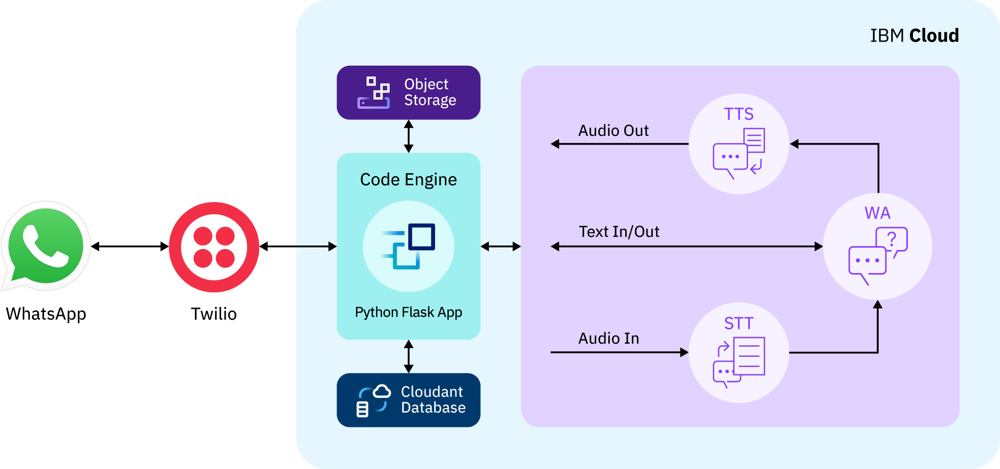

# Voice and Text Chatbot designed for WhatsApp and Telegram

We built a text and voice conversational user interface deployed for WhatsApp and Telegram using IBM Watson Speech-to-Text, IBM Watson Assistant, and IBM Watson Text-to-Speech. A Python Flask application integrates these services and stores the chatbot conversation history on IBM Cloudant and media sent and received by the chatbot on IBM Cloud Object Storage. Twilio, a third-party service, integrate the Python Flask application and WhatsApp. Telegram does not require any third-party service to integrate the Python Flask app and its application.

For more information refer to the [project website.](https://ibm.github.io/customized-voice-text-bot-for-whatsapp-telegram/)
