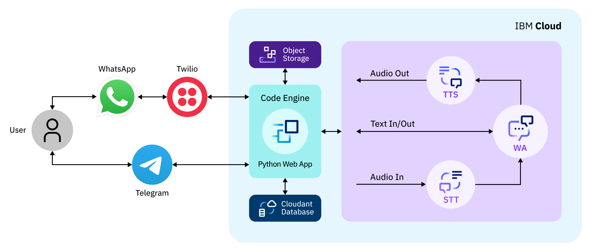

Voice and Text Chatbot designed for WhatsApp and Telegram
=========================================================

We built a text and voice conversational user interface deployed for WhatsApp and Telegram using IBM Watson Speech-to-Text, IBM Watson Assistant, and IBM Watson Text-to-Speech. A Python Flask application integrates these services and stores the chatbot conversation history on IBM Cloudant and media sent and received by the chatbot on IBM Cloud Object Storage. Twilio, a third-party service, integrate the Python Flask application and WhatsApp. Telegram does not require any third-party service to integrate the Python Flask app and its application.

More information 
================

For more information about the project and instructions about local run and deployment, please refer to the `project website. <https://ibm.github.io/customized-voice-text-bot-for-whatsapp-telegram/>`_. 

How to cite Voice and 'Text Chatbot designed for WhatsApp and Telegram' in your publications
============================================================================================

If you find Voice and Text Chatbot designed for WhatsApp and Telegram to be useful, please consider citing it in your published work:

.. code-block:: python

    @misc{Text Chatbot designed for WhatsApp and Telegram,
      author = {IBM},
      title = {Text and voice conversational user interface deployed for WhatsApp and Telegram using IBM Watson Speech-to-Text, IBM Watson Assistant, and IBM Watson Text-to-Speech},
      note = "https://github.com/IBM/customized-voice-text-bot-for-whatsapp-telegram",
      year = {2022},
    }

License
=======

This software is licensed under Apache 2.0. See `LICENSE <LICENSE>`_.